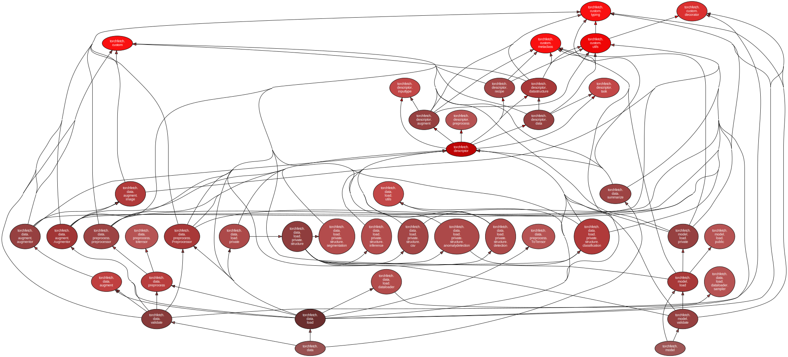

# torchfetch

[](https://www.python.org/downloads/release/python-370/)


### Install
``` 
pip install https://github.com/jaeminSon/torchfetch
(github ID, password 입력 필요)
```
### Usage
``` 
>>> import torchfetch

# get dataloader (classification)
>>> kwargs_dataloader = {"num_workers": 16, "pin_memory": True, "batch_size": 32, "shuffle": True}
>>> dataloader = torchfetch.get_dataloader(data="Test/objects/data/image_csv",   
                                           preprocess="Test/objects/preprocess/imagenet.json",  
                                           augment="Test/objects/augment/imagenet.json", 
                                           **kwargs_dataloader)  
>>> for batch in dataloader:
...     <process batch>
    
# get dataloader (detection)
>>> kwargs_dataloader = {"num_workers": 16, "pin_memory": True, "batch_size": 16, "shuffle": True, "collate_fn": lambda x: x}
>>> dataloader = torchfetch.get_dataloader(data="Test/objects/data/detection1",  
                                           preprocess="Test/objects/preprocess/detection1.json",  
                                           augment="Test/objects/augment/cocodetection.json", 
                                           **kwargs_dataloader)

# public network class instantiation
>>> network = torchfetch.instantiate_network("resnet50")
>>> network = torchfetch.instantiate_network("resnet34", **{"pretrained":True})

# load a network from model name (or recipe name for private architecture)
>>> network = torchfetch.get_pretrained_network("Test/objects/recipe/private_arch.json")

# network class instantiation
>>> network = torchfetch.instantiate_network("Test/objects/recipe/private_arch.json")

# get checkpoint
>>> checkpoint = torchfetch.get_checkpoint("Test/objects/recipe/private_arch.json")

# get network state dict
>>> model_state_dict = torchfetch.get_model_state_dict("Test/objects/recipe/private_arch.json")

# get optimizer state dict
>>> optimizer_state_dict = torchfetch.get_optimizer_state_dict("Test/objects/recipe/private_arch.json")

```

### File structure
```
# install graphviz and pydeps
linux: $ sudo apt install graphviz
mac: $ brew install graphviz

$ pip install pydeps

# draw dependency graph
$ pydeps torchfetch --reverse --only torchfetch --exclude-exact torchfetch

# No cycle found with the following command
$ pydeps torchfetch --reverse --only torchfetch --exclude-exact torchfetch --show-cycles

```



### Custom data example (classification with image and annotation json file)


## Custom data types
  
 
  
 


